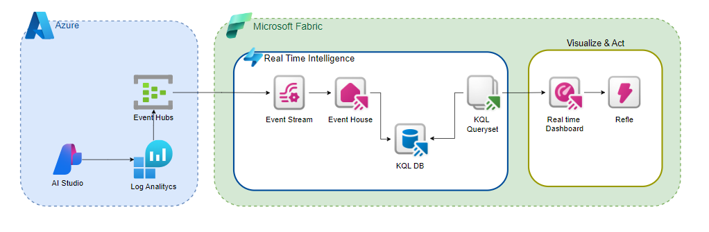

# Fabric AI Observability & Evaluation

## Overview

The **Fabric** is a Microsoft SaaS platform it's a solution to enhance data observability and troubleshooting . It provides:

- **Tracing**: Trace your application's runtime and data pipelines using advanced telemetry-based instrumentation integrated with Microsoft Fabric's tools.
- **Evaluation**: Leverage built-in analytics and AI capabilities to benchmark application performance using custom evaluations and metrics, enabling deeper insights into system performance.
- **Datasets**: Create and manage versioned datasets within the Microsoft Fabric Lakehouse for experimentation, evaluation, and machine learning model fine-tuning, supporting end-to-end workflows.

Fabric seamlessly integrates with Microsoft’s ecosystem, offering a comprehensive suite of tools such as Real-Time Analytics, Data Activator for alerting, and KQL Queryset for advanced querying. 
It provides robust features for organizations looking to build, deploy, and monitor secure and scalable solutions, all within a unified platform.

## Fabric Observability solution Architecture



This solution contains:

- Get data in the Real-Time hub
- Store date into Eventhouse
- Split data usin table update policy
- Create a KQL query
- Create a Real-Time dashboard
- Explore data visually in the Real-Time dashboard
- Set an alert on the eventstream or Real-Time dashboard

  
## End to end tutorial

### Prerequisites

To successfully complete this tutorial, you need : 

- **Microsoft Fabric** [workspace](https://learn.microsoft.com/en-us/fabric/get-started/create-workspaces) with enabled [capacity](https://learn.microsoft.com/en-us/fabric/enterprise/licenses) or [trial capacity](https://learn.microsoft.com/en-us/fabric/get-started/fabric-trial). 
- **Azure Event Hubs** Stream to event hub collected traces, evaluation metrics and logs. [Stream to an event hub](https://learn.microsoft.com/en-us/azure/azure-monitor/essentials/create-diagnostic-settings?tabs=portal). 


### Create an eventhouse

1. Browse to the workspace in which you want to create your tutorial resources. You must create all resources in the same workspace.
1. Select **+ New item**.
1. In the **Filter by item type** search box, enter **Eventhouse**.
1. Select the Eventhouse item.
1. Enter *Tutorial* as the eventhouse name. A KQL database is created simultaneously with the same name.
1. Select **Create**. When provisioning is complete, the eventhouse **System overview** page is shown.

Documentation  [Create an eventhouse documentation](https://learn.microsoft.com/en-us/fabric/real-time-intelligence/create-eventhouse)

1. Clone the repository:
   ```bash
   git clone https://github.com/your-repository/fabric-deployment-hub.git

2.	Navigate to the project directory:
    ```bash
    cd fabric-deployment-hub
    ```
3. Restore dependencies and build the project:
    ```bash
    dotnet restore
    dotnet build
    ```
### Running Locally

1. Update appsettings.json with your configuration values.
2. Start the application: `dotnet run`
3. Access the APIs at http://localhost:5000.

### Containerization

1. Build the Docker image: `docker build -t fabric-deployment-hub .`
2. Run the container: `docker run -p 5000:80 fabric-deployment-hub`

### Deployment to Azure Container Apps

1. Ensure containerapp-config.json is configured for your environment.
2. Deploy the app using Azure CLI: `az containerapp up --source . --name fabric-deployment-hub --resource-group <your-resource-group>`

## License

This project is licensed under the terms of the MIT License.