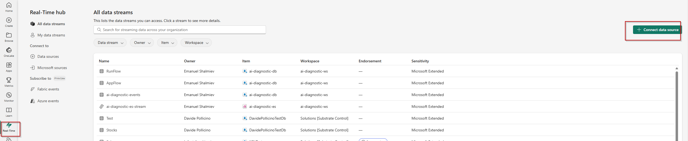
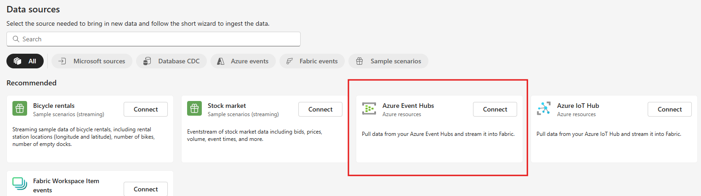

# Fabric AI Observability & Evaluation

## Overview

The **Fabric** is a Microsoft SaaS platform it's a solution to enhance data observability and troubleshooting . It provides:

- **Tracing**: Trace your application's runtime and data pipelines using advanced telemetry-based instrumentation integrated with Microsoft Fabric's tools.
- **Evaluation**: Leverage built-in analytics and AI capabilities to benchmark application performance using custom evaluations and metrics, enabling deeper insights into system performance.
- **Datasets**: Create and manage versioned datasets within the Microsoft Fabric Lakehouse for experimentation, evaluation, and machine learning model fine-tuning, supporting end-to-end workflows.

Fabric seamlessly integrates with Microsoft’s ecosystem, offering a comprehensive suite of tools such as Real-Time Analytics, Data Activator for alerting, and KQL Queryset for advanced querying. 
It provides robust features for organizations looking to build, deploy, and monitor secure and scalable solutions, all within a unified platform.

## Fabric Observability solution Architecture


This solution contains:

- Ingest, capture and route real-time events using **Event Streams** 
- Route events into **Eventhouse**
- Split data using table **update policy**
- Create a **KQL query**
- Create a **Real-Time dashboard**
- Explore data visually in the **Real-Time dashboard**
- Set an **alert** on the eventstream or Real-Time dashboard
  
## End to end tutorial

### Prerequisites

To successfully complete this tutorial, you need : 

- **Microsoft Fabric** [workspace](https://learn.microsoft.com/en-us/fabric/get-started/create-workspaces) with enabled [capacity](https://learn.microsoft.com/en-us/fabric/enterprise/licenses) or [trial capacity](https://learn.microsoft.com/en-us/fabric/get-started/fabric-trial). 
- **Azure Event Hubs** Stream to event hub collected traces, evaluation metrics and logs. [Stream to an event hub](https://learn.microsoft.com/en-us/azure/azure-monitor/essentials/create-diagnostic-settings?tabs=portal). 


### Create an eventhouse

1. Browse to the workspace in which you want to create your tutorial resources. You must create all resources in the same workspace.
1. Select **+ New item**.
1. In the **Filter by item type** search box, enter **Eventhouse**.
1. Select the Eventhouse item.
1. Enter *Tutorial* as the eventhouse name. A KQL database is created simultaneously with the same name.
1. Select **Create**. When provisioning is complete, the eventhouse **System overview** page is shown.

  Documentation  [Create an eventhouse documentation](https://learn.microsoft.com/en-us/fabric/real-time-intelligence/create-eventhouse)


### Ingest, capture and route event to Eventhouse

- **Create an eventstream**

1. Select **Real-Time** on the left navigation bar.
1. Select **+ Connect data source** in the top-right corner of the page. 



1. On the **Data sources** page, select **Azure Event Hubs** category.


   
1. On the **Connect** page, create **New connections**, in the opened window, do these steps:
  - Enter the name of the Event Hubs namespace.
  - Enter the name of the event hub.
  - For Connection name, enter a name for the connection to the event hub.
  - For Authentication kind, confirm that Shared Access Key is selected.
  - For Shared Access Key Name, enter the name of the shared access key.
  - For Shared Access Key, enter the value of the shared access key.
  - Select Connect at the bottom of the page.

   

1. After the connection and the eventstream are created successfully, you see the following updated **Review + connect** page.
      
   

1. Select **Open Eventstream**.

- **Create a destination**
         
1. From the menu ribbon, select **Edit**. The authoring canvas, which is the center section, turns yellow and becomes active for changes.

    :::image type="content" source="img/event-stream-edit-button.png" alt-text="Screenshot with the Edit button selected." lightbox="img/event-stream-edit-button.png":::         

1. Select Publish on the ribbon.

    :::image type="content" source="img/publish.png" alt-text="Screenshot showing the green plus icon selected.":::    

1. In Edit Mode select **Destinations** > **Eventhouse**.
    
    :::image type="content" source="img/event-house-selected.png" alt-text="Screenshot showing the Eventhouse destination selected.":::    

1. Enter the following information in the **Eventhouse** pane:

    :::image type="content" source="img/kql-database-details.png" alt-text="Screenshot showing the Eventhouse destination pane in Real-Time Intelligence.":::

1. Ensure that the box **Activate ingestion after adding the data** is checked.
1. Select **Save**.
1. From the menu ribbon, select **Publish**.

   The eventstream is now set up to transform events and send them to a KQL database.

**Related content**

* [Create an eventstream](https://learn.microsoft.com/en-us/fabric/real-time-intelligence/event-streams/add-source-azure-event-hubs?pivots=enhanced-capabilities)
* [Add a KQL database as a destination](https://learn.microsoft.com/en-us/fabric/real-time-intelligence/event-streams/add-destination-kql-database?pivots=enhanced-capabilities)


### Split data usin table update policy


### Split data usin table update policy

1. Create a target table:
   ```bash
      .create table 
        RunFlow (EventTime:datetime,item_OperationId:guid,item_ParentId:string,AppName:string,Variant:string,Deployment:string,OpenAIApiVersion:string,
                TotalTokens:long,PromptTokens:long,CompletionTokens:long,Duration:long,IsSameAsPreviousIntentSystemPrompt:string,
                IsSameAsPreviousChatSystemPrompt:string,Coherence:real,Groundedness:real,Relevance:real,Similarity:real,
                IntentSystemPrompt:string,ChatSystemPrompt:string,Temperature:string,Seed:long)
   ```  

2. Create a query:
   ```bash 
      .create-or-alter function RunFlowInsert() {
      let AppTracesTbl = 
        ['ai-diagnostic-events']
          | extend item = parse_json(records)
          | mv-expand item
          | serialize
          | extend RowNumber = row_number(1, prev(PartitionId) != PartitionId) 
          | where item.Type == "AppTraces"
          | project EventProcessedUtcTime, PartitionId, RowNumber, item, metricName = item.metricName, Target = item.Target, Type = item.Type, PropertiesPayload = dynamic_to_json(item.Properties.payload);
      AppTracesTbl
      | project item_time = todatetime((item)["time"]),  toguid(item.OperationId) , tostring(item.ParentId), Message = dynamic_to_json(item.Message)
      | where Message has "batch-evaluation-flow-metrics"
      | extend parsed_json = parse_json(Message)
      | extend 
              AppName = tostring(parsed_json.metadata.tags.run_configuraton.application_name),		
              Variant = tostring(parsed_json.metadata.tags.run_configuraton.variant),
              IntentSystemPrompt = tostring(parsed_json.metadata.tags.run_configuraton.intent_system_prompt),
              ChatSystemPrompt = tostring(parsed_json.metadata.tags.run_configuraton.chat_system_prompt),
              Deployment = tostring(parsed_json.metadata.tags.run_configuraton.llm_config.azure_deployment),
              OpenAIApiVersion = tostring(parsed_json.metadata.tags.run_configuraton.llm_config.openai_api_version),
              Temperature = tostring(parsed_json.metadata.tags.run_configuraton.llm_config.model_parameters.temperature),
              Seed = tolong(parsed_json.metadata.tags.run_configuraton.llm_config.model_parameters.seed),
              TotalTokens = tolong(parsed_json.metadata.properties.system_metrics.total_tokens),
              PromptTokens = tolong(parsed_json.metadata.properties.system_metrics.prompt_tokens),
              CompletionTokens = tolong(parsed_json.metadata.properties.system_metrics.completion_tokens),
              Duration = tolong(parsed_json.metadata.properties.system_metrics.duration)
      | where isnotempty(Variant)         
      | mv-expand result = parsed_json.result
      | extend metric = tostring(result.metric), score = toreal(result.score)
      | project-away Message, parsed_json, result
      | evaluate pivot(metric, any(score))
      | sort by item_time asc
      | extend PreviousIntentSystemPrompt = prev(IntentSystemPrompt)
      | extend IsSameAsPreviousIntentSystemPrompt = iff(IntentSystemPrompt == PreviousIntentSystemPrompt or isempty(PreviousIntentSystemPrompt), "Yes", "No")
      | extend PreviousChatSystemPrompt = prev(ChatSystemPrompt)
      | extend IsSameAsPreviousChatSystemPrompt = iff(ChatSystemPrompt == PreviousChatSystemPrompt or isempty(PreviousChatSystemPrompt), "Yes", "No")
      | project EventTime = item_time,item_OperationId,item_ParentId,AppName,Variant,Deployment,OpenAIApiVersion,TotalTokens,
        PromptTokens,CompletionTokens,Duration,IsSameAsPreviousIntentSystemPrompt,IsSameAsPreviousChatSystemPrompt,
        Coherence = coherence,Groundedness = groundedness,Relevance = relevance,Similarity = similarity,IntentSystemPrompt,ChatSystemPrompt,Temperature,Seed
      }
   ```  

3. Create a update policy:
   ```bash 
      .alter table RunFlow policy update
      @'[{ "IsEnabled": true, "Source": "ai-diagnostic-events", "Query": "RunFlowInsert()", "IsTransactional": true}]'
   ```  
4. Backfill existing data from SourceTable to TargetTable:
   ```bash 
    .set-or-append RunFlow <|
    RunFlowInsert()
   ```  

### Create a KQL query


1. Build the Docker image: `docker build -t fabric-deployment-hub .`
2. Run the container: `docker run -p 5000:80 fabric-deployment-hub`

### Deployment to Azure Container Apps

1. Ensure containerapp-config.json is configured for your environment.
2. Deploy the app using Azure CLI: `az containerapp up --source . --name fabric-deployment-hub --resource-group <your-resource-group>`

## License

This project is licensed under the terms of the MIT License.